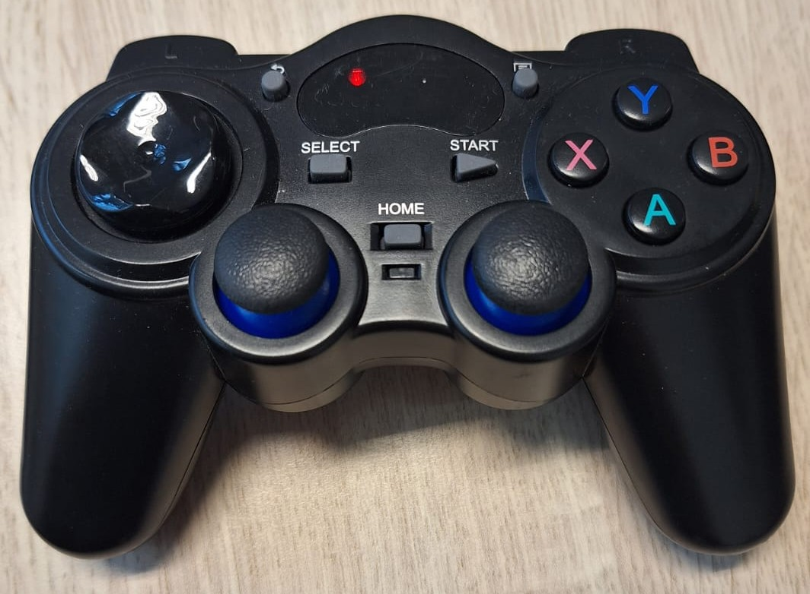

# Jetracer_WS_github
This repo contains basic code to run the jetracers for the hackathon.


## Installation
Clone this repo 
```
git clone https://github.com/Lorenzo-Lyons/Jetracer_WS_github.git
```

### Create a new branch for your group 
First navigate the newly created Jetracer_WS_github folder and list available remote branches by typing:
```
git branch -r
```
Select the hacakthon branch by typing:
```
git branch hackathon_18_Jan_2024
```
Check the outcome by viewing all local branches by typing:
```
git branch
```
Finally create a new local branch with the initials of the group members, for example:
```
git checkout -b hackathon_18_Jan_2024_ABCD
```

### Build and source the catkin workspace

Re-build the catkin workspace by typinig:
```
catkin clean -y
catkin build
```
Now source the newly created ros workspace by adding the required line in the .bashrc file. Then close and reopen all terminals (also close and reopen VScode) in order for the changes to take effect. (in .bashrc)
```
source PATH_TO_GIT_REPO/Jetracer_WS_github/devel/setup.bash
```
If needed check out the ROS setup tutorial: http://wiki.ros.org/ROS/Tutorials/InstallingandConfiguringROSEnvironment


## Kinematic bicycle Jetracer Model
The Jetracers are controlled by providing them with throttle and steering inputs, respectively:

```math
\begin{align*}\tau \in [-1,+1]\\\sigma \in [-1,+1]\end{align*}
```
The behaviour of the Jetracer can be modelled with a kinematic bicycle model, assuming that the velocity is below 1.5 m/s:
```math
\begin{align*}
    \begin{bmatrix}\dot{x}\\\dot{y}\\\dot{\eta}\\\dot{v}\end{bmatrix}&=\begin{bmatrix}v\cos{\eta}\\v\sin{\eta}\\\frac{v \tan(\delta(\sigma))}{l}\\f(\tau,v)\end{bmatrix}
\end{align*}
```
Where $x,y,\eta,v$ are respectively the x-y position,orientation and longitudinal velocity. $l$ is the length of the Jetracer. 

The mapping from the steering input $\sigma$ to the steering angle $\delta$ [rad] has been obtained experimentally and is specific for each Jetracer. For convenience the function *steer_angle_2_command(steer_angle,car_number)* in Jetracer_WS_github/src/lane_following_controller_pkg/src/functions_for_controllers.py maps the desired steering angle $\delta$ into the required steering input $\delta$ for each vehicle.


<p align="center">
  
</p>


The acceleration function $f(\tau,v)$ has also been estimated experimentally. It features a throttle dependent term and a velocity dependent friction term. It is detailed in the fuction *evaluate_Fx_2(vx, th)* in Jetracer_WS_github/src/lane_following_controller_pkg/src/functions_for_controllers.py


<p align="center">
  
</p>


## Running the robots
Each vehicle is identified by a number set as an environment variable in the .bashrc file located in the home directory. Upon launching a new terminal the "car_number" will be displayed. Many scripts need this value to properly set up topic names. This is needed for running experiments with multiple robots.

**Activate the robot.** Open a terminal and run a ros master:
```
roscore
```
In order for the robot to react to control inputs run the following file:

```
rosrun cytron_jetracer racecar_universal.py
```
> [!NOTE]
> Many controller .launch files already run this script so this step may not be necessary in some cases.

To control the vehicle just publish values between $[-1,1]$ to the topics *steering_<car_number>* and *throttle_<car_number>*. However it may be more practical to use some of the provided low-level or high-level controllers as detailed below.


## Available low level controllers

The package *lane_following_controller_pkg* cointains low level controllers that use the previously described kinematic bicycle model to control the robot. 

**Velocity tracking controller.** This controller tracks a reference velocity. To do so simpy publish a reference velocity value to the topic *v_ref_<car_number>*.

The controller works by means of a feedforward-feedback controller defined as:

```math
\begin{align*}
\tau = - K(v-v_{ref}) + \tau^{ff}
\end{align*}
```
Where $K$ is a gain and $\tau^{ff}$ is defined as:
```math
\begin{align*}
\tau^{ff} =\tau\text{  s.t.  } f(\tau,v_{ref})=0
\end{align*}
```

The current vehicle velocity $v$ is provided by an encoder. To start the sensor publishing:

```
rosrun cytron_jetracer publish_sensors_and_inputs_universal.py
```
To start the longitudinal velocity tracking controller run:
```
rosrun lane_following_controller_pkg longitudinal_controller.py
```
**Steering controller.** To send a desired steering angle to the robot simply use the function $\delta(\sigma)$ as described in the previous section. The publish to the topic *steering_<car_number>*

## Available high level controllers
**Gamepad control with velocity reference.**
<p align="center">
  
</p>
This controller allows the user to set a reference velocity and simultaneously steer the vehicle. The controller uses the gamepad provided by waveshare in the jetracer pro AI kit. First of all ensure that the gamepad is properly connected by plugging in the usb dongle and pressing the "home" button on the gamepad. A single red light should be visible on the gamepad. Then launch the controller by typing:

```
roslaunch cytron_jetracer v_ref_gamepad_controller.launch
```
To set the velocity reference press the "Y" and "A" keys.

**Lane following controller.**


<p align="center">
  
</p>

The lane following controller allows the vehicle to autonomously track a user-defined reference track (pink line in the video) at a certain reference velocity. It requires a previously built map of the environment.

To build a map of the environment first launch the file:

```
roslaunch localization_and_mapping_jetracer_pkg slam_jetracer_universal.launch
```
Note that the vehicle needs to navigate the environment in order to map it. A convenient way of doing so is to run the velocity tracking controller described in the previous section.


To save the map type:
```
rosrun map_server map_saver -f map_name
```

To use the map in the lane following controller first make sure it is in the folder *saved_maps_from_slam* located in the localization_and_mapping_pkg package. Then edit the *map_file* parameter in *the map_server.launch* file to match the newly created map. Then launch the map server file.

```
roslaunch localization_and_mapping_jetracer_pkg map_server.launch
```
Now launch the lane following controller.

```
roslaunch lane_following_controller_pkg lane_following_controller.launch
```
To modify the reference path edit the function *produce_track* located in the file *functions_for_controllers.py*.


